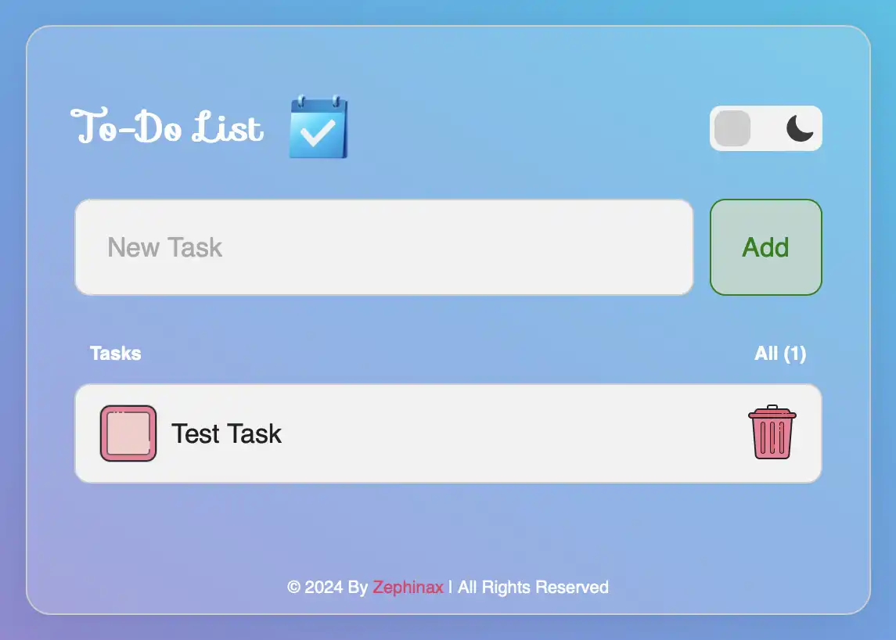

<h2 align="center">
  To-Do-App 
  <a href="https://Zephinax.ir/" target="_blank">Click Here To Show Demo</a>
</h2>
 

 

 &nbsp;
 &nbsp;
 &nbsp;

<h3 align="center">
    🔹
    <a href="https://github.com/Zephinax/Portfolio/issues">Report Bug</a> &nbsp; &nbsp;
    🔹
    <a href="https://github.com/Zephinax/Portfolio/issues">Request Feature</a>
</h3>

# To-Do-App

This is simple To Do app with html &amp; css &amp; javaScript | I hope it is useful for you

## Features

- Have simple & user friendly ui
- Fully responsive design
- Tasks save on local storage and are not deleted by exiting the browser or refreshing
- Dark mode

## Authors

- [@Zephinax](https://github.com/Zephinax)
